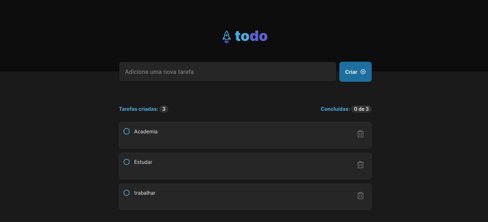

# APP Todo

Esta aplicação foi desenvolvida a partir do desafio do treinamento de ReactJS da Rocketseat, o desafio proposto foi desenvolver uma lista de tarefas, a famosa to-do list. O design da aplicação é fornecido pelo treinamento, na estilização da aplicação foi utilizado o SASS.

### Funcionalidades:

- Adicionar uma nova tarefa
- Marcar e desmarcar uma tarefa como concluída
- Remover uma tarefa da listagem
- Mostrar o progresso de conclusão das tarefas

### Foi praticado os conceitos como:

- Estados
- Imutabilidade do estado
- Listas e chaves no ReactJS
- Propriedades
- Componentização

## Tecnologias utilizadas
___

## A aplicação está hospedada na Vercel
___

[https://ignite-trilha2022-desafio01-praticando-os-conceitos-do-reactjs.vercel.app/](https://ignite-trilha2022-desafio01-praticando-os-conceitos-do-reactjs.vercel.app/)

